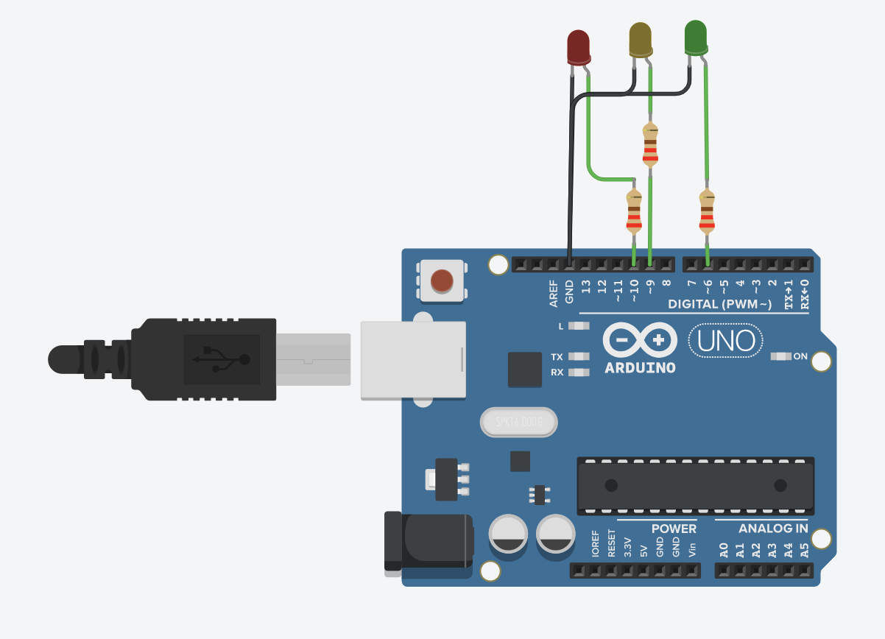

# gloveArduinoToMaya
Drive servo motor with autodeskMaya and Arduino

## Ressources :
__main.ino__ : is the code to upload inside the Arduino
__mayaCommand.py__ : open command port inside the maya scene for give access to the datas from arduino
__arduinoToMaya.py__ : it's python code for open and connect the serial port between arduino and maya
__scene_test.ma__ : scene ready to use the codes mayaToArduino.py

## How it work :
Do the capteur assembly on the arduino with the draw.
Upload the code main.ino to the arduino.
Keep the arduino connected with computer.
From maya execute the mayaCommand.py code
Execute python script arduinoToMaya.py inside one terminal for launch the transfert of datas

## Montage :
Button :

LEDs :

MPU6050 :

Flex :

